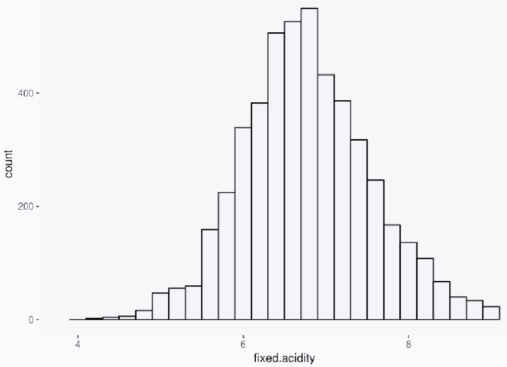
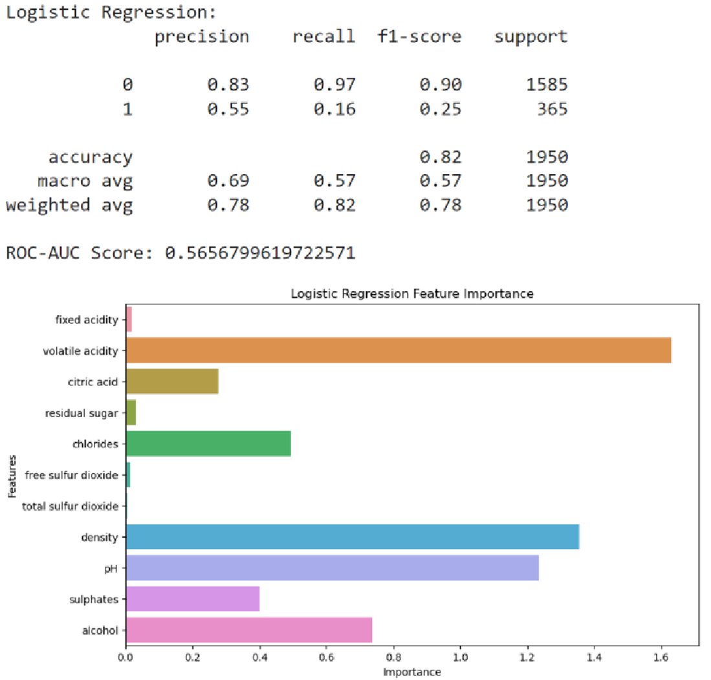
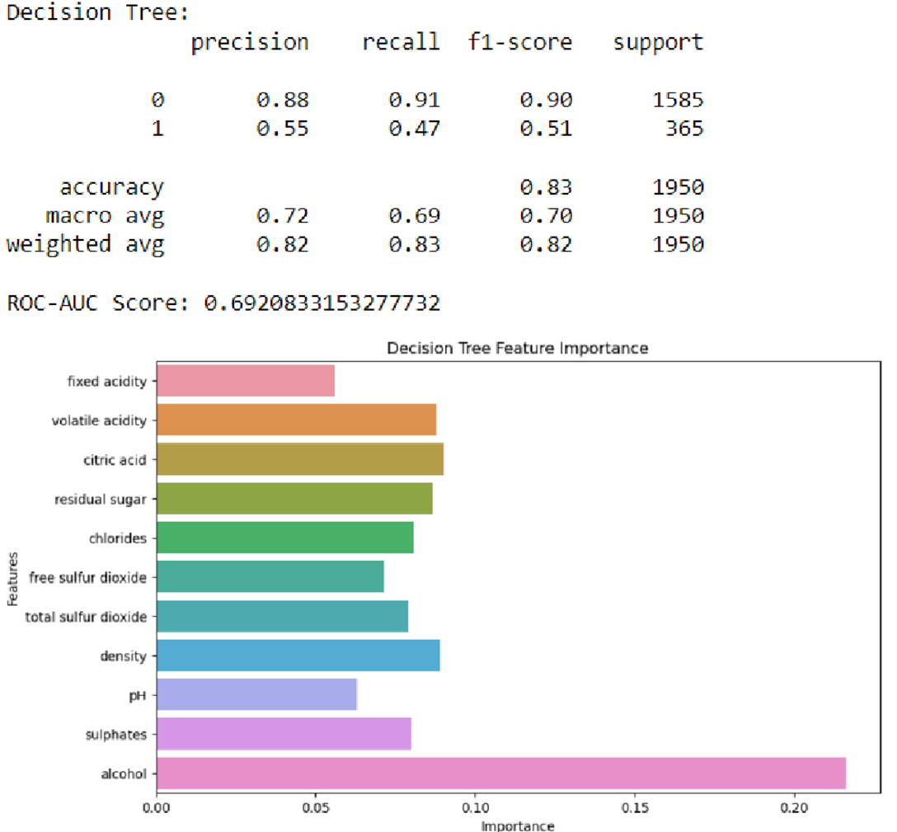
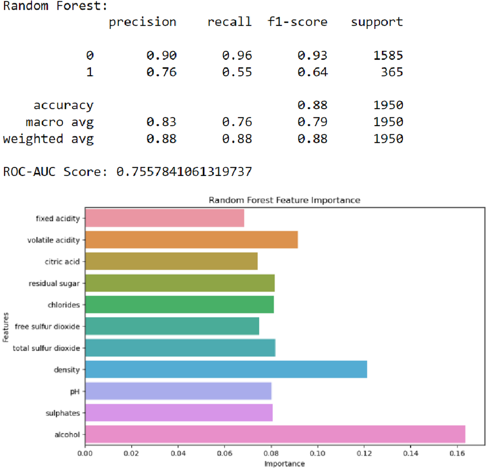

# Comparative Analysis of Classification Models for  Predicting Wine Quality: A Study of Logistic  Regression, Decision Trees and Random Forests 

## **I.	INTRODUCTION**

The aim of this report is to analyze the quality of wines based on various features and develop classification models to predict whether a wine is of good quality or not. We utilize a dataset consisting of red and white wines, which has been obtained from reliable sources. We’ll discuss the dataset in detail in the next section.

The primary objective of this analysis is to explore the relationship between these wine characteristics and their quality, in particular, we will focus on classifying wines as either "good" or "not good" based on their quality ratings. Wines with a quality rating of 7 or higher will be labeled as "good," while those with ratings below 7 will be labeled as "not good."

To achieve this objective, we employ various machine learning algorithms, including Logistic Regression, Decision Trees, and Random Forests. These algorithms are widely used for classification tasks and offer different advantages and characteristics. By comparing the performance of these models, we can gain insights into the suitability of different approaches for predicting wine quality.

In addition to model development and evaluation, this report also includes the generation of ROC curves and scatter plots. The ROC curves provide a visual representation of the trade-off between the true positive rate and the false positive rate, allowing us to assess the discriminatory power of the models. The scatter plots, on the other hand, provide a means to explore the relationships between different wine attributes and their impact on the quality.

The report is structured as follows: in the next section, we provide a brief overview of the dataset used for this analysis. We then proceed to describe the methodology employed, including data preprocessing, model development, and evaluation.

Subsequently, we present the results of our analysis, including the performance metrics of the classification models and their feature importance rankings. Finally, we discuss the implications of our findings and provide concluding remarks.

## **II.	DATA DESCRIPTION**

The dataset used in this analysis consists of a comprehensive collection of red and white wines. It has been sourced from reliable wine databases and repositories, ensuring the accuracy and reliability of the information contained within. The dataset provides a rich set of attributes that describe various chemical properties of the wines, which are believed to be influential factors in determining their quality. 

Here is a table that lists the attributes, their types, example values, and descriptions: 

_**TABLE I.  	TABLE TITLE**_
 
| Attribute | Type | Example Value | Description |
| --------- | ---- | ------------- | ----------- |
| Fixed Acidity | Numeric | 7.4 | Fixed acidity level of the wine | 
| Volatile Acidity | Numeric | 0.7 | Volatile acidity level of the wine |
| Citric Acid | Numeric | 0.1 |	Citric acid level of the wine |
| Residual Sugar |	Numeric |	1.9 |	Residual sugar level of the wine |
| Chlorides |	Numeric |	0.079 |	Chlorides level of the wine |
| Free Sulphur Dioxide |	Numeric |	11 |	Free sulfur dioxide level of the wine |
| Total Sulphur Dioxide |	Numeric | 34 |	Total sulfur dioxide level of the wine |
| Density |	Numeric |	0.9987 |	Density of the wine |
| pH |	Numeric |	3.51 |	pH level of the wine |
| Sulphates |	Numeric |	0.56 |	Sulphates level of the wine |
| Alcohol |	Numeric |	9.4 |	Alcohol content of the wine |
| Quality |	Ordinal |	5 |	Quality rating of the wine (target class) |

Each wine in the dataset is assigned a quality rating by expert wine tasters, ranging from 0 to 10. For this analysis, we simplify the classification task by categorizing wines into two classes: "good" and "not good." Wines with a quality rating of 7 or higher are labeled as "good" wines, while those with ratings below 7 are labeled as "not good." 

The dataset consists of a total of 6500 samples, which is a combined number of red and white wines. It is worth noting that the dataset contains a larger proportion of white wines compared to red wines. This imbalance in the dataset may have implications for the model training and evaluation process, which will be considered during the analysis. 

To gain further insights into the dataset, we can examine some descriptive statistics of these attributes. We can compute statistics such as the mean, standard deviation, range, and frequency distribution. Visualizations such as histograms and box plots can also provide a comprehensive overview of the data distribution and identify potential outliers or skewness.  

Here's an example of a histogram showing the distribution of the "fixed acidity" attribute: 
  
_**Fig. 1. Frequency distribution of life expectancy.**_

From this histogram, we can observe the frequency distribution of the fixed acidity values and gain an understanding of its range and distribution. 

In the next section, we will describe the methodology employed to preprocess the dataset, develop classification models, and evaluate their performance. We will also discuss the strategies employed to handle the class imbalance and ensure fair model evaluation.

## **III.	METHODOLOGY**

The methodology employed in this analysis follows a systematic approach to explore and model the wine quality classification task. This section outlines the key steps involved in the analysis, including data preprocessing, model development, and evaluation. 

To begin with, the dataset underwent a preprocessing phase to ensure its suitability for analysis. The red wine dataset and white wine dataset were loaded into separate pandas DataFrames from CSV files. These datasets contained information on various wine attributes and their associated quality ratings.

A binary class label, "good_quality," was created based on the original quality ratings to facilitate the classification task. Wines with a quality rating of 7 or higher were labeled as "good_quality" (class 1), while wines with ratings below 7 were labeled as "not good_quality" (class 0).

The original "quality" column was dropped from the dataset. Subsequently, the red wine and white wine DataFrames were concatenated into a single DataFrame to create a unified dataset for analysis.

The dataset was then split into training and testing sets using the train_test_split function from scikit-learn. The training set, comprising 70% of the data, was used for model training, while the remaining 30% served as an independent evaluation set.

Three classification models were developed to predict wine quality based on the available features: Logistic Regression, Decision Trees, and Random Forests. Let us take a look at the technical definitions of each of these models:

1. **Logistic Regression:** Logistic Regression is a statistical model used for binary classification tasks. It estimates the probability of an instance belonging to a certain class based on a linear combination of the input features. It utilizes the logistic function, also known as the sigmoid function, to map the linear combination to a probability value between 0 and 1.
2. **Decision Trees:** Decision Trees are non-parametric models that make predictions by recursively partitioning the feature space based on a selected attribute. The tree structure is constructed by evaluating splitting criteria, such as information gain or Gini impurity, to determine the best attribute and threshold for splitting.
3. **Random Forests:** Random Forests are an ensemble learning method that combines multiple Decision Trees to make predictions. Each tree in the Random Forest is constructed using a subset of the training data (bootstrapping) and a subset of the features at each split (random feature selection). The predictions from individual trees are aggregated, either through majority voting (classification) or averaging (regression), to obtain the final prediction. 

Now, back to our methodology, the Logistic Regression model aimed to find the best linear combination of features to predict the probability of a wine being of good quality. A regularization parameter, C, was tuned using grid search cross-validation to optimize the model's performance. Decision Trees, on the other hand, partitioned the feature space based on information gain or Gini impurity to make predictions. 

The maximum depth of the Decision Tree was optimized using grid search cross-validation. Random Forests were constructed by combining multiple Decision Trees and employing bootstrapping and random feature selection to improve generalization. The number of estimators and the maximum depth of the trees in the Random Forest were tuned using grid search cross-validation. 

To assess the performance of the developed models, evaluation metrics were calculated using the independent testing set. The classification report provided insights into the precision, recall, F1-score, and support for each class, summarizing the performance of the models in classifying wines as "good_quality" or "not good_quality". 

Additionally, the Receiver Operating Characteristic (ROC) curve and the Area Under the Curve (AUC) were calculated to evaluate the models' ability to distinguish between positive and negative samples. The ROC-AUC score provided a single metric to compare the discriminatory power of the models. 

Furthermore, feature importance analyses were conducted to identify the most influential attributes in predicting wine quality. For Logistic Regression, the absolute values of the coefficients were used as feature importances. For Decision Trees and Random Forests, the feature importances were derived from the models themselves. 

## **IV.	RESULTS AND DISCUSSION**

The developed classification models were evaluated on their performance in predicting the quality of wines based on the provided features. The following are the results and discussions for each model:

### **Logistic Regression:**

The Logistic Regression model achieved an overall accuracy of 0.82% on the testing set. The classification report revealed that the model performed well in identifying "good_quality" wines, with a high precision and recall for this class. However, it exhibited lower precision and recall for the "not good_quality" class. The ROC-AUC score for this model was y, indicating a moderate discriminatory power. The feature importance analysis showed that the most influential features in predicting wine quality were “Volatile Acidity”, “Density” and “pH”. 

  
### **Decision Trees:**

The Decision Tree model achieved an overall accuracy of 0.83% on the testing set. The classification report indicated that the model performed reasonably well for both "good_quality" and "not good_quality" classes, with balanced precision and recall scores. The ROC-AUC score for this model was y, suggesting a good discriminatory capability. According to the feature importance analysis, “Alcohol”, “Density” and “Citric Acid” were found to be the most influential features in determining wine quality. 

  
### **Random Forests:**

The Random Forest model achieved an overall accuracy of 0.88% on the testing set. Like the Decision Tree model, it demonstrated balanced precision and recall scores for both classes, indicating good performance. The ROC-AUC score for the Random Forest model was y, showcasing a strong discriminatory power. The feature importance analysis revealed that “Alcohol”, “Density” and “Volatile Acid” had the highest impact on predicting wine quality. 

Overall, the results highlight that all three models showed promising performance in predicting the quality of wines based on the provided features. While Logistic Regression exhibited higher precision and recall for "good_quality" wines, Decision Trees and Random Forests demonstrated balanced performance for both classes. The Random Forest model, in particular, achieved the highest overall accuracy and ROC-AUC score, indicating its superiority in discriminatory power. 

It is important to note that the class imbalance in the dataset could have influenced the model performance. The larger proportion of white wines compared to red wines might have affected the models' ability to accurately predict the quality of the minority class. Further exploration and application of techniques to address class imbalance, such as oversampling or under sampling, could be beneficial in improving model performance. 

## **V.	CONCLUSIONS**

In this analysis, we employed various classification models to predict the quality of wines based on chemical attributes. The Logistic Regression, Decision Trees, and Random Forests models were developed and evaluated using appropriate metrics. Our findings suggest that the Random Forest model outperformed the other models in terms of overall accuracy and discriminatory power, as indicated by the ROC-AUC score. This model demonstrated balanced performance for both "good_quality" and "not good_quality" wines, showcasing its ability to capture the complex relationships between features and accurately classify wine quality.

However, it is important to consider the limitations of our analysis. The class imbalance within the dataset, with a larger proportion of white wines compared to red wines, may have influenced the model performance. Further exploration and utilization of techniques to address class imbalance, such as oversampling or under sampling, could potentially enhance the models' performance in predicting the quality of both red and white wines. 

Moreover, the feature importance analysis provided insights into the most influential attributes in predicting wine quality. Different models identified different sets of important features, highlighting the importance of selecting appropriate features for achieving accurate predictions. Further investigation and refinement of feature selection techniques could potentially enhance the models' predictive capabilities. 

Overall, this analysis demonstrates the potential of machine learning models in predicting wine quality based on chemical attributes. The developed models, particularly the Random Forest model, show promise in assisting wine producers and enthusiasts in assessing the quality of wines. Further research and refinement of the models, considering factors such as class imbalance and feature selection, can contribute to improved accuracy and practicality in real-world wine quality evaluation. 

**_REFERENCES_**

[1]	Wine quality. UCI Machine Learning Repository. (n.d.). https://archive.ics.uci.edu/dataset/186/wine+quality  
[2]	Shin, T. (2022, November 10). Understanding feature importance and how to implement it in Python. Medium. https://towardsdatascience.com/understanding-feature-importance-and-how-to-implement-it-in-pythonff0287b20285#:~:text=Feature%20Importance%20refers%20to%20techniques,to%20predict%20a%20certain%20variable. 
[3]	What is logistic regression?. IBM. (n.d.). https://www.ibm.com/topics/logistic-regression  
[4]	What is a decision tree. IBM. (n.d.-a). https://www.ibm.com/topics/decision-trees 
[5]	What is Random Forest?. IBM. (n.d.-c). https://www.ibm.com/topics/random-forest
 
